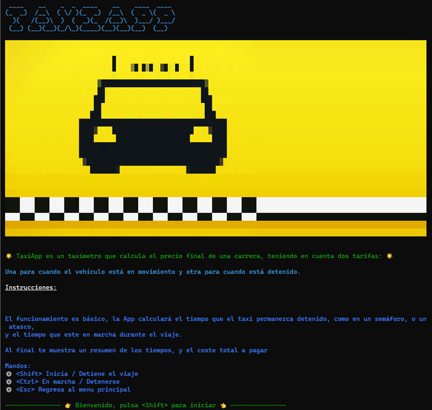
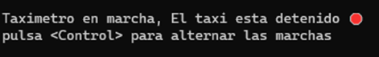
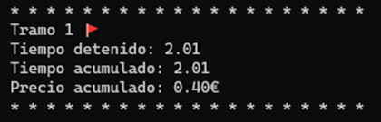
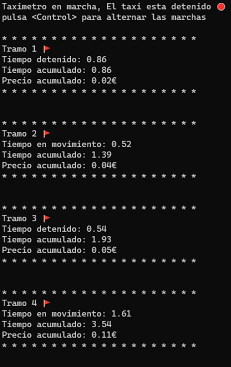
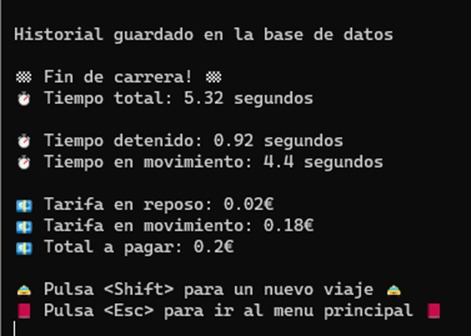
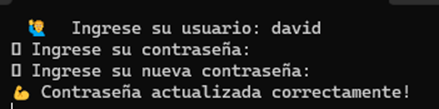
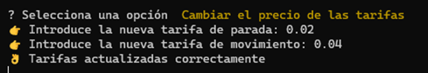
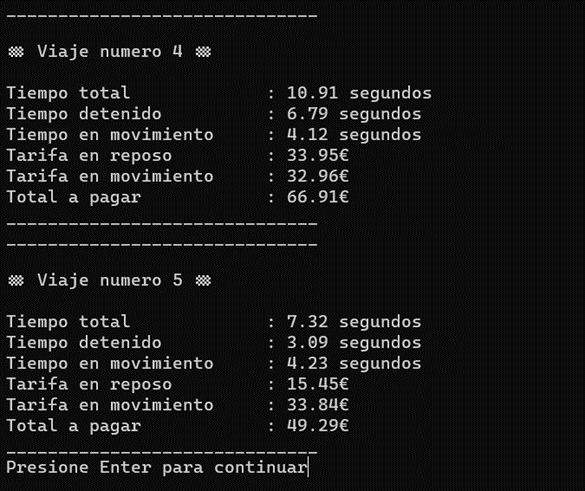
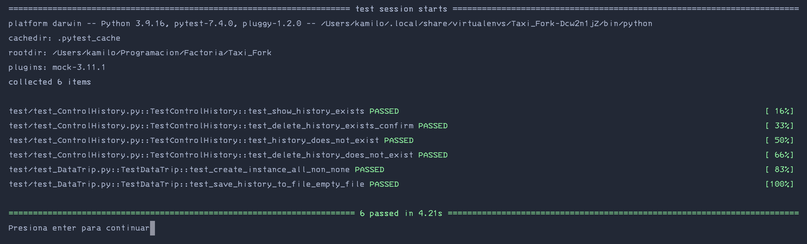
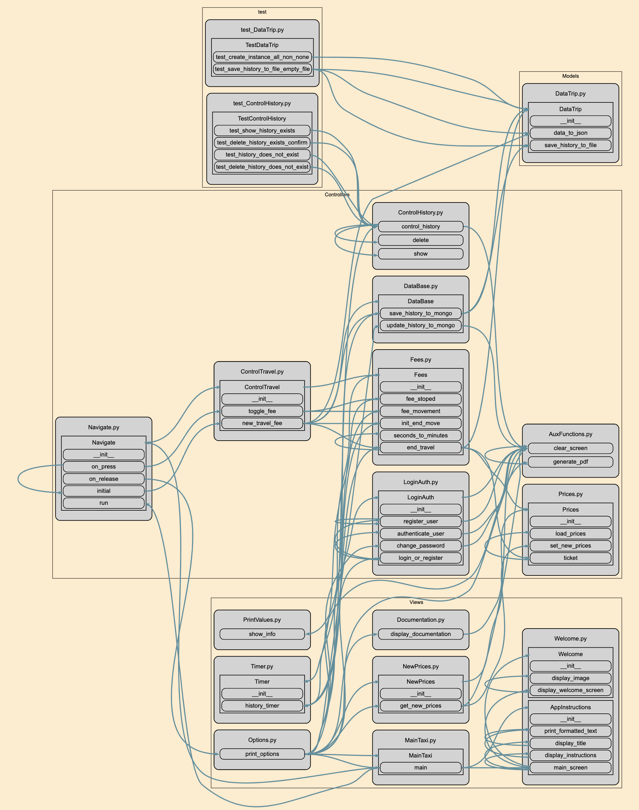

#### [Start the taximeter](#start-the-taximeter)

- [x] Start the taximeter

By selecting this option, you will be able to use the application's Taximeter. Detailed instructions on its operation will be displayed and the application will be on hold until you decide to start the race. This flexibility allows you to have full control over when you want to start calculating your fare. The application will be ready to capture the necessary data and perform the corresponding calculations once you indicate the start of the race.

To start the taximeter, simply press the "Shift" key. At that time, the app will start accumulating travel time using the predefined rate for waiting time (stopped mode). This function allows you to start recording the time and cost of the trip easily and accurately. From this point on, the meter will continue to run until you decide to stop it.

Once the taxi starts, you can easily switch to the moving fare by pressing the "Ctrl" key. When doing so, the application will update the screen display to show the elapsed time, the price corresponding to the moving fare and the total time accumulated so far. This functionality allows you to have a clear and precise tracking of the time and the cost of the trip in each stage, giving you more information and control over the progress of the race.

The application allows you to make fare changes flexibly and according to the movement of the taxi. Simply press the "Ctrl" key each time you want to switch between the moving rate and the stopped rate. You can make this change as many times as necessary, depending on the conditions and the movement of the taxi. Each time the change is made, the app will update the screen to show the accumulated time, the price corresponding to the current fare and any other relevant information to keep an accurate record of the trip. This functionality gives you the freedom to adjust the fare according to the actual circumstances of the trip.

To end the race, simply press the "Shift" key. At that time, the application will display the stopped time, moving time, and total time accumulated during the trip, along with the total amount to be paid based on the corresponding fare. This will provide you with a complete overview of the relevant aspects of the trip.

In addition, the application offers you two options after finishing the race:
- To start a new race, you can press the "Shift" key. This will reset the taximeter and allow you to start a new trip without having to close and reopen the app.
- To exit the application, you can press the "Esc">" key. This will close the app after the current trip has finished.
These options give you the convenience of taking quick and easy actions at the end of a run and preparing for the next one.

#### [Change password](#change-password)

- [x] Change password

By selecting this option, you will be able to change the current application password. To do this, you will be asked to enter the following data:
- User: Enter your username to correctly identify your account.
- Old password: Provide your current password as a security measure.
- New password: Enter the new password you want to use to access the application.
Once you have entered these data, the application will save the changes and update the password associated with your account. This ensures that your information is protected and allows you to keep your account secure by using a new password.

#### [Change fare prices](#change-fare-prices)

- [x] Change fare prices

By accessing this option, you will be able to adjust the prices of the fares used in the taximeter. Follow the next steps:
1. Enter Stop Fee: Specify the price per second when the taxi is stopped.
2. Enter the moving rate: Specify the price per second when the taxi is moving.
Once you have entered the fare values, the app will save your changes and update the fare used in the taximeter calculation. This allows you to customize fares based on your needs or local regulations, ensuring correct billing while traveling.

#### [View trip history](#view-trip-history)

- [x] View trip history

By selecting this option, you will be able to access an on-screen display of all the routes or trips recorded on the device where the application is installed, in case there is no connection available with the database.
This functionality allows you to review and consult the history of previous trips locally, without depending on an internet connection. You will be able to see relevant information for each trip, such as the duration, the rates applied and any other details recorded during the trip.
It is important to note that this option will only be available when a connection to the database cannot be established. Once the connection is re-established, you can sync with the database.

#### [Download trip history](#download-trip-history)

- [x] Download trip history

By accessing this option, you will be able to generate a PDF document containing all the journeys or trips recorded on the device where the application is installed, in case there is no connection available with the database.

The application will process the travel information and generate the corresponding PDF document. After completing the process, a confirmation message will be displayed to let you know if the file has been generated successfully. The document will be saved under the name "history.pdf" in the directory where the application is installed.

This PDF file will allow you to have a complete and portable record of the trips made, even in situations where you do not have access to the online database. You can easily view and share your trip history in PDF format, which is convenient for reporting or detailed activity tracking.

#### [Delete trip history](#delete-trip-history)

- [x] Delete trip history

By selecting this option, you will have the possibility of deleting all the routes or trips that have been registered on the device where the application is installed, as long as there is no connection available with the database at that moment.
The application will ask you if you are sure to delete the locally stored data. If you wish to proceed with the deletion, you will need to enter the letter "s" as confirmation. Once you have entered the confirmation, the application will completely delete the history saved locally.
This function allows you to clean up local records when the connection to the database could not be established, ensuring orderly and updated data management. It is important to note that this option will only affect the data stored on the device at that moment, without affecting the information stored in the centralized database when a connection is available.

#### [Update Database](#update-database)

- [x] Update Database

Through this option, you will be able to send the data of the routes that were generated in the application while there was no connection to the database. These routes will continue to be stored in the application's local history, but they will also be sent to the centralized database to allow subsequent queries.

By selecting this option, the application will establish a connection to the database (if available) and transfer the locally stored tracks. Once the transfer has been completed successfully, the trips will be available both in the local history and in the centralized database.

#### [Perform tests](#perform-tests)

- [x] Perform tests

When accessing this option, the application will do the tests

#### [View graph call](#view-graph-call)

- [x] View graph call
